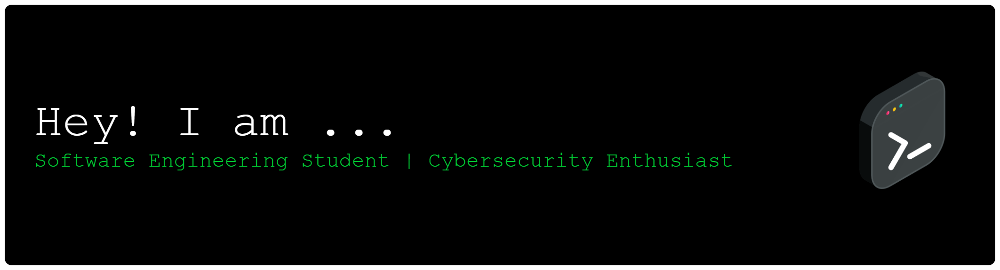

# Hello! 

My name is Linda Christi and I'm a Software Engineering Student/Cybersecurity Enthusiast. I'm from Brazil, living in Rio de Janeiro. You can find me on [![LinkedIn][3.2]][3].

## 🔧 Technologies & Tools

## &#x1f4c8; GitHub Stats

 

<!-- link to social media icon -->

<!-- icon without padding -->

[3.2]: https://github.com/LindaChristi/LindaChristi/blob/fb6bcbeb8af2d465642fe5e77fe848090aa1b1f7/linkedin-3-16.png (LinkedIn icon without padding)

<!-- link social media account -->

[3]: https://www.linkedin.com/in/linda-christi-freitas-de-bastos-23874a254/

## 📈 Contribution Graph

